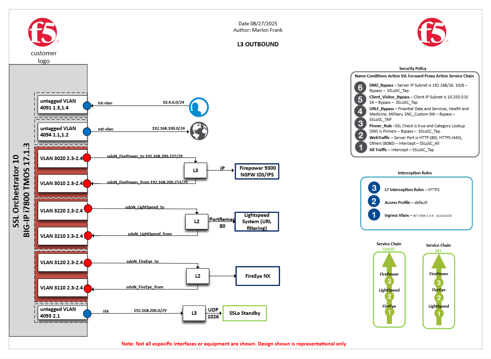
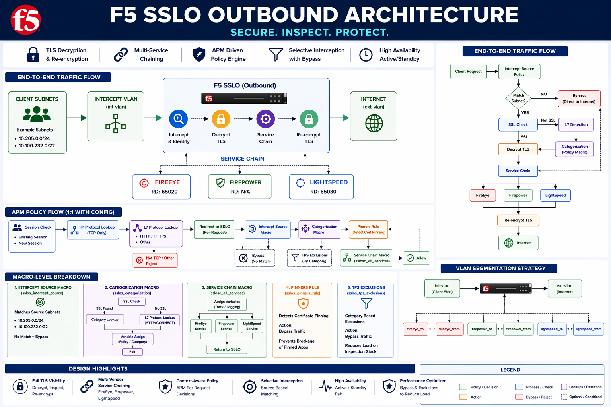
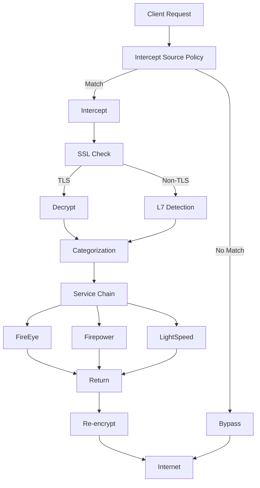
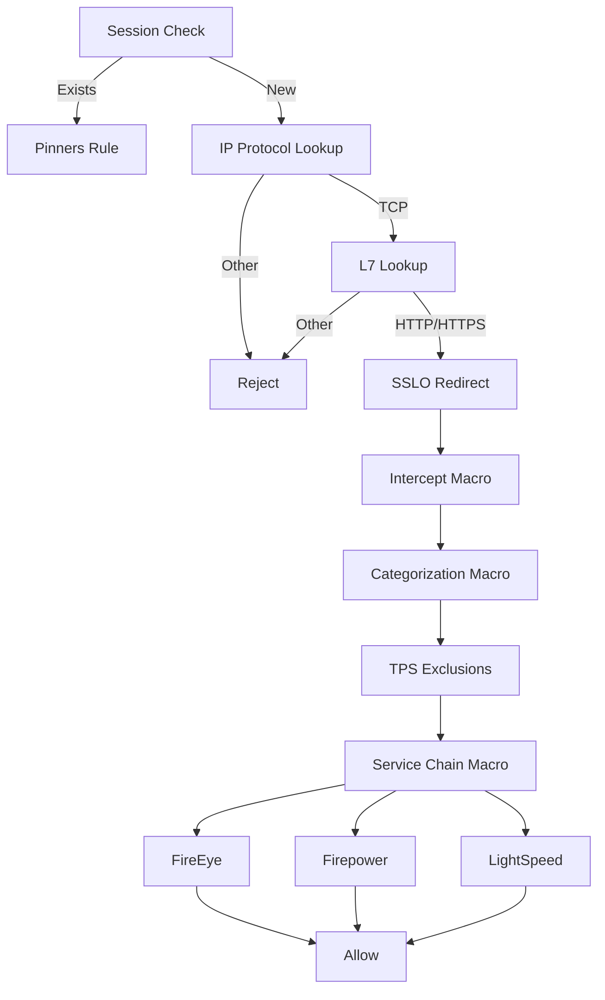
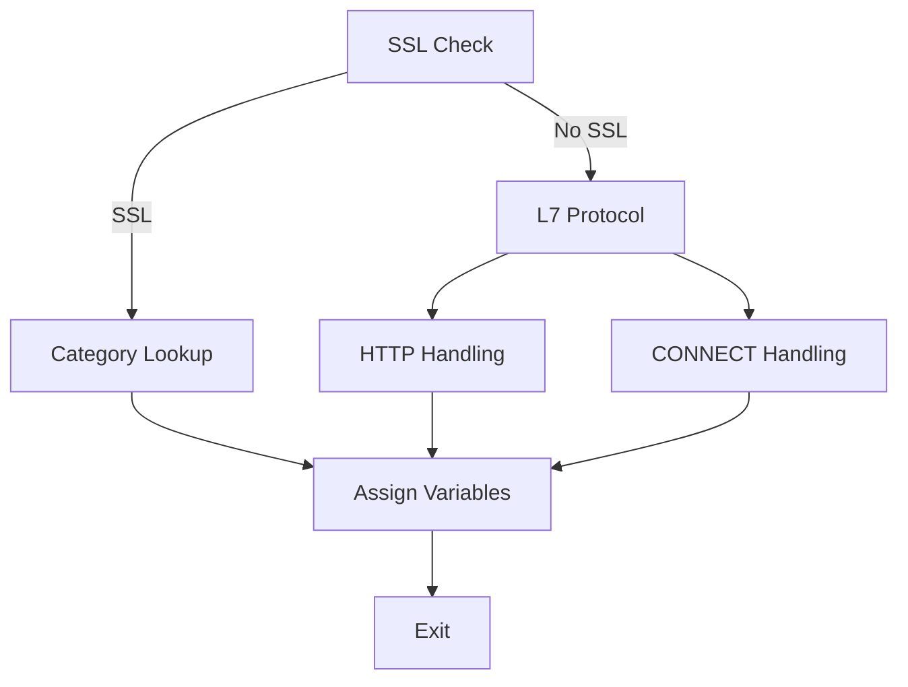
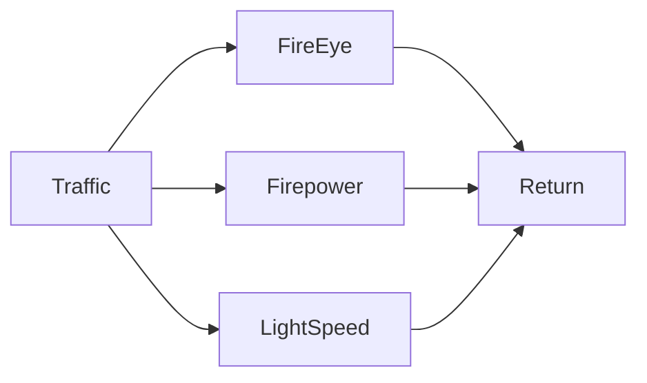
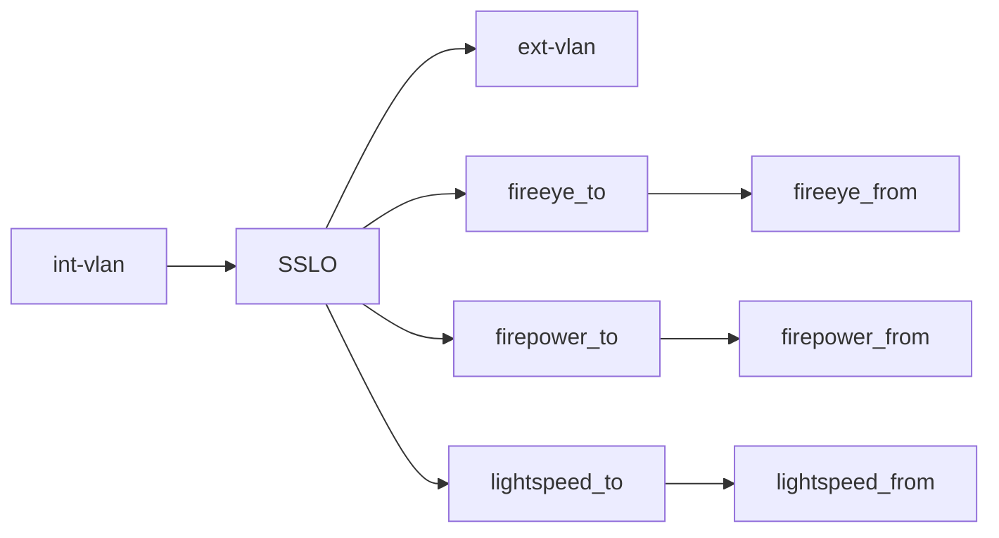

# F5 SSLO Outbound Architecture

This repo contains a full production-quality SSLO documentation including flows, macros, service chains, and design insights.

---

# 🧭 Architecture Overview

# 🧭 Architecture Overview with Flows
---

# 🔁 End-to-End Traffic Flow

---

# 🧠 APM Policy Flow

---

# 🔬 Macro-Level Breakdown

## Intercept Source Macro
- Matches defined internal subnets
- Non-match = bypass

---

## Categorization Macro
IP address spreedsheet mappings  

## Categorization Macro

---

## Service Chain Macro (sslosc_all_services)

---

## Pinners Rule
- Detects certificate pinning
- Forces bypass

---

## TPS Exclusions
- Category-based bypass
- Reduces inspection load

---

# 🌐 IP Addressing (Cleaned & Grouped)

## Core Interfaces

| Function | IP | VLAN |
|---------|----|------|
| Internal | 10.4.0.8 | int-vlan |
| External | 192.168.100.13 | ext-vlan |

---

## Firepower

| Direction | IP | VLAN |
|----------|----|------|
| To | 192.168.200.225 | firepower_to |
| From | 192.168.200.241 | firepower_from |

---

## FireEye

| Direction | Range | VLAN | RD |
|----------|------|------|----|
| To | 198.19.34.0/27 | fireeye_to | 65020 |
| From | 198.19.34.0/27 | fireeye_from | 65020 |

---

## LightSpeed

| Direction | Range | VLAN | RD |
|----------|------|------|----|
| To | 198.19.35.0/27 | lightspeed_to | 65030 |
| From | 198.19.35.0/27 | lightspeed_from | 65030 |

---

# 🔀 VLAN Segmentation Strategy

---

# 🧱 Design Highlights

- Selective interception
- Full TLS visibility
- Multi-service inspection
- APM-driven decisions
- High availability (HA pair)

---

# 📌 Notes
- Built from real SSLO config
- Designed for SA-level documentation
------------------------------------------------------------------------
- ## License

This project is intended for operational automation within F5 environments.  
Use at your own risk and validate in a test environment prior to production deployment.

------------------------------------------------------------------------

# 🤝 Contributing

Pull requests welcome:

-   Automation examples
-   Architecture diagrams
-   Policy templates

------------------------------------------------------------------------

# ⭐ Credits

Architecture based on enterprise F5 BIG-IP SSLo deployment patterns and
real-world designs.

------------------------------------------------------------------------

## 🧑‍💻 Author
**Marlon Frank**  
*Network and Application Security & F5 Automation Engineer*  
